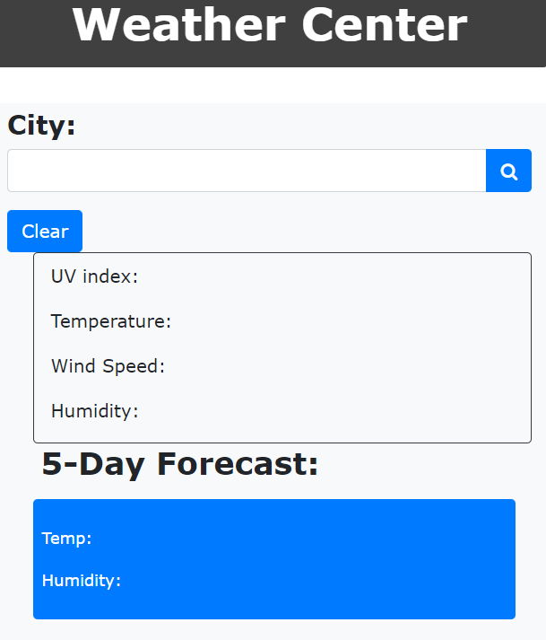

# weather-center

## Description

This project is to catch current weather data using APIs and javascript functions.

- My motivation for this project was to work on utilizing different APIs
- I built this project to demonstrate weather APIs and utilizing keys
- This project solves usages of fetching weather data and storign local data.
- I learned how to use a more in depth site to develop more complex javascript. 

## Usage
Search for cities to see certain stats about their real -time weather conditions. 

!
    

## Credits

Credit is due to Sean Dillon, Juliet Lamond, Tabitha Salmon, Lucas Razon, and Freddy Kwak as they are part of my study group. 

## License

MIT License

Copyright (c) [2022] [JoshuaRae]

Permission is hereby granted, free of charge, to any person obtaining a copy
of this software and associated documentation files (the "Software"), to deal
in the Software without restriction, including without limitation the rights
to use, copy, modify, merge, publish, distribute, sublicense, and/or sell
copies of the Software, and to permit persons to whom the Software is
furnished to do so, subject to the following conditions:

The above copyright notice and this permission notice shall be included in all
copies or substantial portions of the Software.

THE SOFTWARE IS PROVIDED "AS IS", WITHOUT WARRANTY OF ANY KIND, EXPRESS OR
IMPLIED, INCLUDING BUT NOT LIMITED TO THE WARRANTIES OF MERCHANTABILITY,
FITNESS FOR A PARTICULAR PURPOSE AND NONINFRINGEMENT. IN NO EVENT SHALL THE
AUTHORS OR COPYRIGHT HOLDERS BE LIABLE FOR ANY CLAIM, DAMAGES OR OTHER
LIABILITY, WHETHER IN AN ACTION OF CONTRACT, TORT OR OTHERWISE, ARISING FROM,
OUT OF OR IN CONNECTION WITH THE SOFTWARE OR THE USE OR OTHER DEALINGS IN THE
SOFTWARE.

# Link

https://github.com/joshuar2155/weather-center